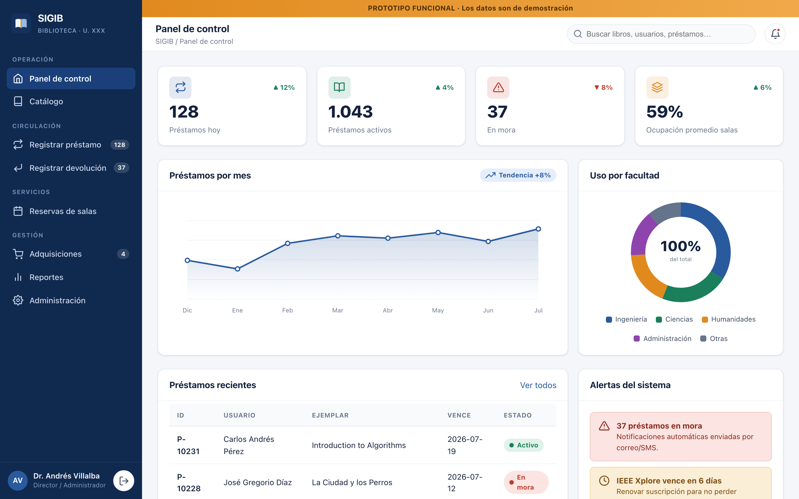
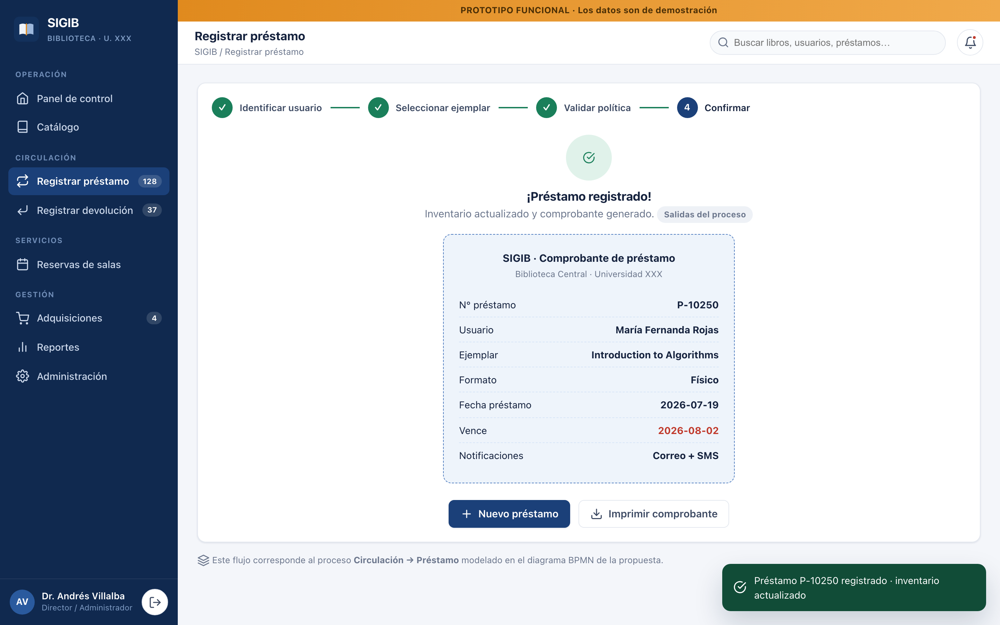
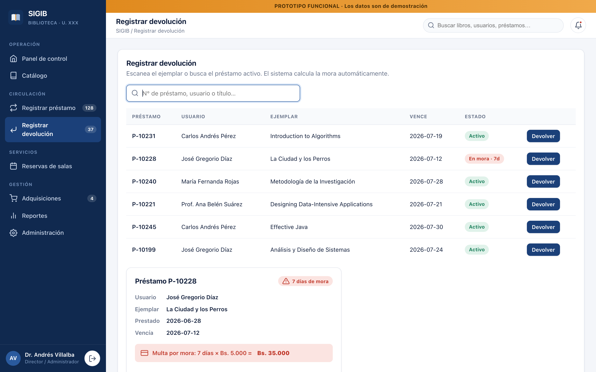
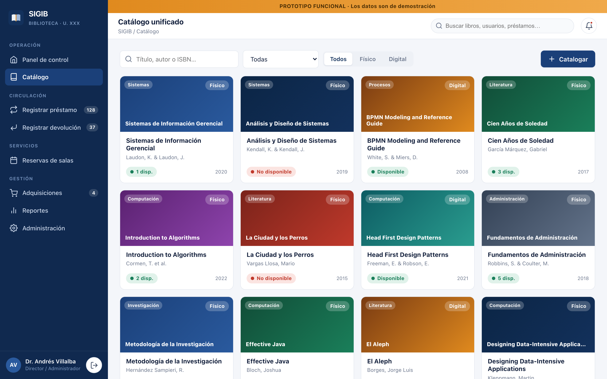
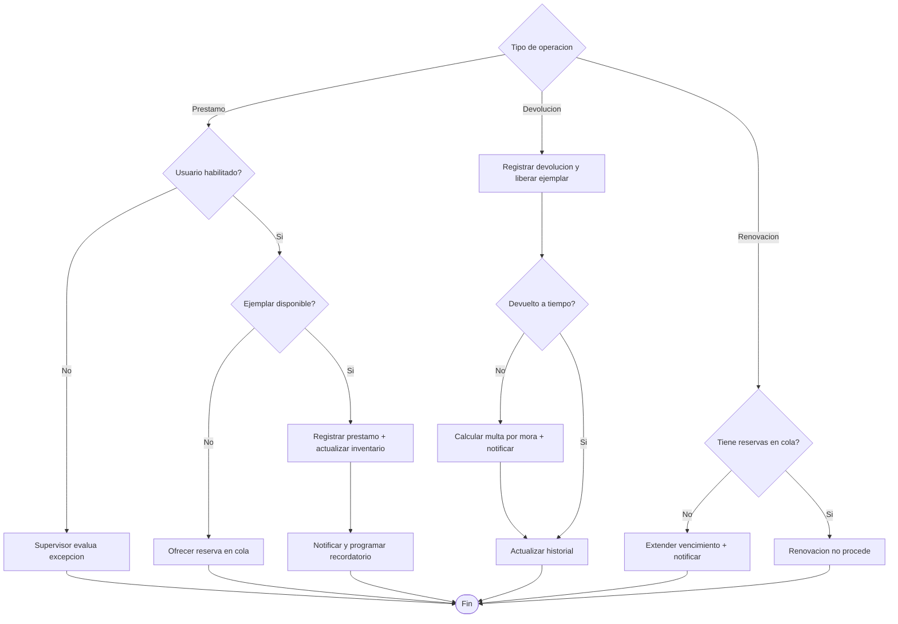

# SIGIB — Sistema de Información para la Gestión Integral de la Biblioteca

> Proyecto de la asignatura **Sistemas de Información** (Grupos #7 y #8).
> Propuesta formal, modelado **BPMN** y **prototipo funcional** para la Biblioteca Central de la **Universidad XXX** (Caracas, Venezuela).

<p>
  
  
  
  
</p>

## 🔗 Enlaces rápidos

| Recurso | Enlace |
|---|---|
| ▶ **Prototipo interactivo** (GitHub Pages) | **https://marcel54536.github.io/sigib-biblioteca-universidad/prototipo/** |
| 🌐 Sitio del proyecto (landing) | https://marcel54536.github.io/sigib-biblioteca-universidad/ |
| 📄 Propuesta de proyecto (PDF) | [`docs/equipo7-8-Proyecto-final-Biblioteca-XXX.pdf`](docs/equipo7-8-Proyecto-final-Biblioteca-XXX.pdf) |
| 📝 Propuesta (Markdown) | [`docs/propuesta.md`](docs/propuesta.md) |
| 🎬 Guion del video (8 min) | [`docs/guion-video.md`](docs/guion-video.md) |
| 🔀 Diagrama BPMN | [`docs/bpmn/prestamo-devolucion.png`](docs/bpmn/prestamo-devolucion.png) |

---

## 📌 El problema

La Biblioteca Central atiende a **más de 12.000** usuarios con ~50 colaboradores, pero opera con procesos manuales:

- 🗂️ Catálogos físicos y **Excel desincronizados** entre estaciones de trabajo.
- ⏰ Préstamos con tarjetas/planillas, **sin notificaciones automáticas de mora**.
- 📅 Reservas por WhatsApp/correo, **sin calendario unificado**.
- 🔁 Adquisiciones y suscripciones (EBSCO, JSTOR) con recordatorios informales.
- 📊 **Sin dashboard central** de reportes → planificación presupuestaria a ciegas.

## 💡 La solución: SIGIB

Aplicación **web cliente-servidor** con **base de datos relacional centralizada** (única fuente de verdad) y **acceso por roles**. Es un **Sistema de Información integrado**:

- **TPS** (Procesamiento de Transacciones) → catálogo, circulación, reservas, adquisiciones.
- **MIS** (Información Gerencial) → reportes operativos periódicos.
- **DSS** (Soporte a Decisiones) → dashboard analítico (consultas, ocupación, morosidad).

En el dominio bibliotecario, esta categoría corresponde a un **ILS / Sistema Integrado de Gestión Bibliotecaria**.

## 🖼️ Vistas del prototipo

| Dashboard analítico | Préstamo (flujo BPMN) |
|---|---|
|  |  |
| **Devolución con mora** | **Catálogo unificado** |
|  |  |

## 🔀 Proceso modelado (BPMN) — Circulación

Proceso de **préstamo, devolución y renovación** con carriles (Usuario, Bibliotecario, Supervisor, Sistema SIGIB, Pasarela de notificaciones):



> El diagrama completo (con todos los carriles, tareas y compuertas) está en
> [`docs/bpmn/prestamo-devolucion.png`](docs/bpmn/prestamo-devolucion.png) y su fuente en
> [`docs/bpmn/prestamo-devolucion.mmd`](docs/bpmn/prestamo-devolucion.mmd).

## 🗂️ Estructura del repositorio

```
.
├── index.html                     # Landing del proyecto (GitHub Pages)
├── prototipo/                     # Prototipo funcional (SPA, sin build)
│   ├── index.html
│   ├── css/styles.css
│   └── js/{data,charts,app}.js
├── docs/
│   ├── propuesta.md               # Documento formal (fuente Markdown)
│   ├── equipo7-8-Proyecto-final-Biblioteca-XXX.pdf
│   ├── guion-video.md             # Guion del video (8 min)
│   ├── bpmn/                       # Diagrama BPMN (.mmd, .svg, .png)
│   └── assets/                     # Capturas del prototipo
└── build/                         # Scripts de generación (BPMN, PDF, capturas)
```

## 🚀 Ejecutar el prototipo localmente

No requiere instalación ni compilación. Cualquiera de estas opciones:

```bash
# Opción 1: abrir directamente
open prototipo/index.html

# Opción 2: servidor local (recomendado)
cd prototipo && python3 -m http.server 8000
# luego visita http://localhost:8000
```

En la pantalla de inicio se puede elegir el **rol** (Lector, Bibliotecario, Supervisor, Director) para explorar el sistema con distintos permisos. Los datos son de demostración.

## 🛠️ Regenerar artefactos (opcional)

Los scripts de `build/` usan el Chrome del sistema vía `puppeteer-core`:

```bash
cd build && npm install          # puppeteer-core + mermaid (JS)
node render-bpmn.mjs             # .mmd  -> .svg / .png
node build-pdf.mjs               # docs/propuesta.md -> PDF (portada + TOC + paginado)
node screenshots.mjs             # capturas del prototipo (requiere el server local activo)
```

## ✅ Entregables y rúbrica

| Requisito del enunciado | Dónde |
|---|---|
| 1. Oportunidades justificadas | `docs/propuesta.md` §1 |
| 2.a Tipo de SI (justificado) | §2.a (TPS · MIS · DSS integrados) |
| 2.b Requisitos funcionales | §2.b (RF-01…RF-18) |
| 2.c Actores | §2.c |
| 2.d Entradas y salidas | §2.d |
| 2.e Diagrama BPMN | §2.e + `docs/bpmn/` |
| 3. Prototipo (herramienta + flujos) | `prototipo/` + §3 |
| Video (guion 8 min) | `docs/guion-video.md` |
| Documento formal (portada, TOC, páginas, conclusión, referencias) | PDF en `docs/` |

## 👥 Equipo

Grupos #7 y #8 · Sistemas de Información · Universidad XXX

> Completar antes de la entrega: nombres de los integrantes y renombrar el PDF según la convención
> `equipo [N]-Proyecto final-[apellidos_en_orden_alfabético].pdf`.

## 📄 Licencia

[MIT](LICENSE) — material académico de libre uso.
