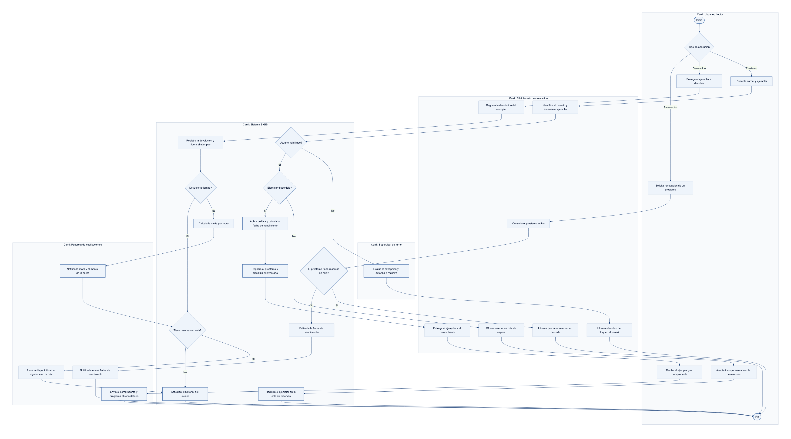
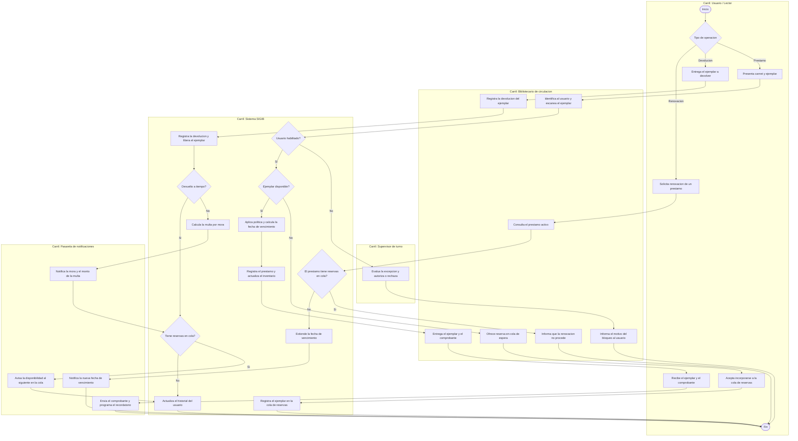

<!--COVER-->
# Sistema de Información para la Gestión Integral de la Biblioteca XXX

### Propuesta de proyecto — Sistemas de Información

**Universidad XXX · Caracas, Venezuela**

| | |
|---|---|
| **Asignatura** | Sistemas de Información |
| **Proyecto** | Enunciado para los Grupos #7 y #8 |
| **Equipo** | Equipo N.º ____ |
| **Integrantes** | José Betorrean  ·  Marcel Garavito  ·  Nicola Sigilo  ·  Melany Timaury |
| **Fecha de entrega** | 19 de julio de 2026 |
| **Prototipo en línea** | https://marcel54536.github.io/sigib-biblioteca-universidad/prototipo/ |
| **Repositorio** | https://github.com/marcel54536/sigib-biblioteca-universidad |

> **Convención de nombre del archivo de entrega:** `equipo [N]-Proyecto final-[apellidos en orden alfabético separados por "_"].pdf`
> — Ejemplo: `equipo 7-Proyecto final-alvarez_martinez_perez.pdf`
<!--/COVER-->

## Tabla de contenido

1. [Resumen ejecutivo](#resumen-ejecutivo)
2. [Introducción](#introducción)
3. [Identificación de oportunidades justificadas](#1-identificación-de-oportunidades-justificadas)
   - 1.a Análisis de los procesos actuales y oportunidades de mejora
   - 1.b Justificación de las oportunidades como necesidades institucionales
4. [Propuesta de un Sistema de Información](#2a-tipo-de-sistema-de-información-justificación)
   - 2.a Tipo de sistema de información (justificación)
   - 2.b Requisitos funcionales
   - 2.c Actores de los procesos de negocio
   - 2.d Entradas y salidas del proceso de negocio
   - 2.e Diagrama BPMN del proceso de Circulación
5. [Prototipo del sistema de información](#3-prototipo-del-sistema-de-información)
   - 3.a Funcionamiento e interacción de los usuarios
   - 3.b Herramienta seleccionada
   - 3.c Alcance del prototipo
6. [Conclusión](#conclusión)
7. [Referencias bibliográficas](#referencias-bibliográficas)

<!--PAGEBREAK-->

## Resumen ejecutivo

La Biblioteca Central de la Universidad XXX (Caracas, Venezuela) atiende a más de 12.000 usuarios entre estudiantes, profesores y personal administrativo, pero su operación descansa en catálogos físicos y hojas de cálculo parciales que no se sincronizan entre estaciones, préstamos gestionados con tarjetas y planillas sin notificaciones de mora, reservas dispersas por WhatsApp y correo, y adquisiciones controladas manualmente. La ausencia de un dashboard central impide analizar el uso y dificulta la planificación presupuestaria.

Para superar estas limitaciones se propone **SIGIB**, una aplicación web cliente-servidor con base de datos relacional centralizada y acceso por roles. Constituye un **Sistema de Información integrado** que combina un núcleo transaccional (**TPS**) para catálogo, circulación, reservas y adquisiciones; una capa gerencial (**MIS**) de reportes periódicos; y funciones de soporte a decisiones (**DSS**) en su dashboard analítico.

Los beneficios esperados incluyen una única fuente de verdad que elimina la desincronización, automatización de notificaciones y multas, calendario unificado de reservas y evidencia analítica para decisiones presupuestarias fundamentadas.

## Introducción

La Biblioteca Central de la Universidad XXX, ubicada en Caracas, Venezuela, constituye un pilar fundamental del quehacer académico e investigativo de la institución, al atender a más de 12.000 estudiantes, profesores y personal administrativo. Su oferta de servicios comprende el préstamo de libros físicos y digitales, la consulta en sala, la reserva de espacios de estudio, la gestión de suscripciones a bases de datos académicas como EBSCO y JSTOR, y el apoyo directo a labores de investigación. Para sostener esta operación, la biblioteca cuenta con aproximadamente 50 colaboradores distribuidos en las áreas de circulación, adquisiciones, catalogación y referencia, bajo la conducción de una dirección central y supervisores por turno.

No obstante, la gestión actual descansa sobre procesos mayormente manuales y herramientas fragmentadas. El catálogo se mantiene en registros físicos y hojas de cálculo parciales que no se sincronizan entre estaciones de trabajo; los préstamos y devoluciones se controlan con tarjetas o planillas, sin notificaciones automáticas de mora; las reservas se coordinan de manera informal por WhatsApp o correo, sin un calendario unificado; y no existe un tablero central que consolide indicadores de uso para orientar la planificación presupuestaria. Esta desarticulación genera duplicidad de esfuerzos, inconsistencias en la información y una limitada capacidad de decisión.

El presente documento tiene como propósito diagnosticar dicha situación y proponer una solución de Sistemas de Información pertinente. Para ello, la estructura se organiza de la siguiente manera: en primer lugar, se analizan las oportunidades de mejora derivadas de los dolores identificados; a continuación, se formula la propuesta del sistema SIGIB, incluyendo su clasificación, procesos, actores y requisitos; y, finalmente, se presenta un prototipo navegable de alta fidelidad que materializa la solución concebida.

## 1. Identificación de oportunidades justificadas

### 1.a Análisis de los procesos actuales y detección de oportunidades de mejora

La Biblioteca Central de la Universidad XXX opera actualmente sobre un conjunto de prácticas manuales, herramientas ofimáticas dispersas y canales de comunicación informales que, si bien han permitido sostener el servicio, generan ineficiencias operativas, riesgos de pérdida de información y una atención inconsistente para una comunidad de más de 12.000 usuarios. A partir del diagnóstico de la situación actual, se identifican los principales dolores por proceso de negocio y las oportunidades de mejora asociadas, con su respectivo impacto esperado sobre el desempeño institucional.

| Proceso | Situación actual (dolor) | Oportunidad de mejora | Impacto esperado |
|---|---|---|---|
| **P1. Gestión de catálogo e inventario** | Registro de libros en catálogos físicos y hojas de Excel parciales, con actualizaciones manuales que no se sincronizan entre estaciones de trabajo. | Catálogo e inventario centralizados en una base de datos relacional única (única fuente de verdad), con estado de cada ejemplar en tiempo real (RF-02, RF-03, RF-04). | Eliminación de la desincronización, reducción de errores de inventario y de la pérdida de ejemplares; búsquedas confiables por título, autor, ISBN, materia y disponibilidad. |
| **P2. Circulación (préstamos y devoluciones)** | Préstamos y devoluciones con tarjetas físicas o planillas; sin notificaciones automáticas de mora ni cálculo sistemático de multas. | Registro transaccional de préstamos y devoluciones según la política del tipo de usuario, cálculo automático de vencimientos y mora, y notificaciones automáticas (RF-05, RF-06, RF-08). | Mayor control de la circulación, disminución de la morosidad, recuperación oportuna de ejemplares y trazabilidad completa del historial del usuario. |
| **P3. Reservas de salas y citas con bibliotecarios** | Reservas de salas de estudio y citas gestionadas por WhatsApp o correo, sin calendario unificado. | Calendario unificado de reservas de salas y citas, con confirmaciones y disponibilidad en línea (RF-10). | Reducción de solapamientos y conflictos de agenda, mejor aprovechamiento de espacios y una experiencia de usuario ordenada y verificable. |
| **P4. Adquisiciones y suscripciones académicas** | Listas manuales a proveedores y seguimiento de suscripciones (EBSCO/JSTOR) con recordatorios informales. | Gestión estructurada de solicitudes, órdenes y recepción, con alertas automáticas de renovación de suscripciones (RF-11, RF-12). | Continuidad del acceso a bases de datos académicas, evita interrupciones de servicio por vencimientos y ordena el gasto en adquisiciones. |
| **P5. Reportes analíticos y evaluación de satisfacción** | No existe un dashboard central de reportes de uso; las evaluaciones de satisfacción se realizan de forma esporádica en papel, sin análisis sistemático. | Capa analítica con dashboard de indicadores y encuestas de satisfacción digitales con análisis (RF-13, RF-14, RF-15). | Decisiones basadas en datos, mejor planificación presupuestaria y mejora continua del servicio a partir de evidencia. |

### 1.b Justificación de las oportunidades como necesidades institucionales

Cada oportunidad detectada no constituye una mejora accesoria, sino una necesidad concreta derivada de la escala de la biblioteca y de su papel dentro de la vida académica de la universidad. A continuación se explica por qué su resolución mejora el desempeño, la eficiencia y la calidad del servicio.

**Gestión de catálogo e inventario.** El uso de catálogos físicos y hojas de Excel parciales que no se sincronizan entre estaciones es la raíz de una cadena de fallas: un ejemplar puede figurar como disponible en una estación y como prestado en otra, lo que produce errores de inventario, discrepancias entre existencias reales y registradas y, en última instancia, pérdida de ejemplares y mala atención al lector. Con más de 12.000 usuarios y cerca de 50 colaboradores operando en paralelo, la ausencia de una fuente de verdad única es insostenible. Centralizar el catálogo en una base de datos relacional resuelve la desincronización de raíz, garantiza que cualquier estación consulte el mismo estado en tiempo real y sustenta las búsquedas confiables que exige la comunidad académica.

**Circulación de préstamos y devoluciones.** Al ser el proceso de mayor volumen transaccional, cualquier ineficiencia en circulación se multiplica diariamente. Gestionar préstamos con tarjetas y planillas, sin notificaciones automáticas de mora, provoca devoluciones tardías, cálculo inconsistente de multas y baja disponibilidad de títulos demandados, perjudicando a toda la comunidad. Automatizar el registro conforme a la política del tipo de usuario, el cálculo de vencimientos y las notificaciones de recordatorio y mora reduce la morosidad, acelera la rotación de ejemplares y libera al personal de circulación para tareas de mayor valor, elevando la eficiencia operativa.

**Reservas de salas y citas.** Coordinar reservas por WhatsApp y correo, sin un calendario unificado, genera solapamientos, dobles reservas y pérdida de solicitudes, además de impedir medir la ocupación real de los espacios. Un calendario unificado ordena la demanda, evita conflictos de agenda y permite optimizar el uso de recursos físicos y del tiempo de los bibliotecarios, mejorando directamente la calidad del servicio percibido.

**Adquisiciones y suscripciones.** El seguimiento informal de suscripciones a bases de datos como EBSCO y JSTOR expone a la universidad a un riesgo crítico: el vencimiento inadvertido de una suscripción interrumpe el acceso a recursos esenciales para la docencia y la investigación. Estructurar las adquisiciones y automatizar las alertas de renovación protege la continuidad del servicio académico y aporta control sobre el gasto, aspecto sensible para el reporte presupuestario ante rectoría.

**Reportes y satisfacción.** La inexistencia de un dashboard central impide conocer los libros más consultados, las tasas de ocupación o los patrones de morosidad, lo que debilita la planificación presupuestaria que la dirección debe presentar mensualmente. Sumado a evaluaciones de satisfacción esporádicas y en papel, la biblioteca decide sin evidencia sistemática. Una capa analítica con reportes exportables y encuestas digitales convierte la operación diaria en información para decidir, cerrando el ciclo de mejora continua y fortaleciendo la rendición de cuentas institucional.

En conjunto, estas oportunidades justifican un sistema de información integrado que atienda simultáneamente la operación transaccional y la necesidad gerencial de decidir con datos, condición indispensable para una biblioteca de esta escala.

## 2. Propuesta de un Sistema de Información

A partir de las oportunidades identificadas, se especifica a continuación el tipo de sistema pertinente, sus requisitos, actores, entradas y salidas, y el modelado BPMN del proceso de circulación.

El sistema de información propuesto se redacta a continuación.

## 2.a Tipo de sistema de información (justificación)

El SIGIB se concibe como un **Sistema de Información integrado**, es decir, una solución única que articula, sobre una misma base de datos centralizada, varios tipos de sistemas que la teoría vista en clase suele presentar por separado según el nivel organizacional al que sirven. Su núcleo es un **TPS**, sobre el cual se construye una capa **MIS** y un conjunto de funciones de **DSS**. En el dominio bibliotecario, esta combinación integrada corresponde a lo que se conoce como **ILS** (*Integrated Library System*) o **Sistema Integrado de Gestión Bibliotecaria** (*LMS*), categoría propia de las bibliotecas que reúne, en un solo producto, la operación diaria y el apoyo a la gestión.

### Definición de los tipos según la teoría

| Tipo | Nivel organizacional | Función principal | Manifestación en el SIGIB |
|------|---------------------|-------------------|---------------------------|
| **TPS** — Sistema de Procesamiento de Transacciones | Operativo | Registrar y procesar las transacciones rutinarias del quehacer diario de forma rápida, exacta y confiable | Catalogación e inventario, circulación (préstamos y devoluciones), reservas y adquisiciones |
| **MIS** — Sistema de Información Gerencial | Táctico / gerencial | Resumir y consolidar los datos transaccionales en reportes periódicos y estructurados para el control de la gestión | Reportes operativos y gerenciales periódicos (uso, morosidad, ocupación) |
| **DSS** — Sistema de Soporte a Decisiones | Estratégico / directivo | Apoyar decisiones semiestructuradas mediante análisis interactivo de datos, modelos y escenarios | Dashboard analítico para planificación presupuestaria y de recursos |

- El **TPS** constituye el corazón transaccional: captura cada operación en el momento en que ocurre (por ejemplo, el registro de un préstamo con su fecha de vencimiento calculada) y garantiza la integridad de los datos que alimentan a los demás niveles.
- El **MIS** toma esos datos ya consolidados y los transforma en reportes estructurados y recurrentes —los informes mensuales que la dirección eleva a rectoría— orientados al control y seguimiento de la gestión.
- El **DSS** ofrece a la dirección capacidades de análisis interactivo (indicadores de libros más consultados, tasas de ocupación de salas, morosidad y uso por facultad) para respaldar decisiones semiestructuradas, principalmente la asignación del presupuesto y la renovación de suscripciones académicas.

### Justificación de la pertinencia

La elección de un SI integrado con este esquema TPS+MIS+DSS responde directamente a las oportunidades y dolores detectados en la biblioteca:

1. **Existe una operación diaria intensamente transaccional.** Los préstamos, devoluciones, reservas y movimientos de inventario ocurren de forma continua y en múltiples estaciones de trabajo. Un **TPS** con base de datos **centralizada** resuelve el dolor principal —la desincronización entre catálogos físicos y hojas de Excel parciales— al constituir una **única fuente de verdad** que actualiza el estado de cada ejemplar en tiempo real. Sin este núcleo transaccional confiable, ninguna capa superior tendría datos válidos.

2. **La gestión requiere reportes periódicos y estructurados.** La dirección debe rendir informes mensuales a rectoría y planificar la operación. El **MIS** cubre esta necesidad al consolidar automáticamente los datos que hoy se recopilan de forma manual y esporádica, eliminando el trabajo artesanal y dando trazabilidad y consistencia a la información gerencial.

3. **Las decisiones presupuestarias son semiestructuradas y requieren análisis.** Decidir qué colecciones ampliar, qué suscripciones (EBSCO, JSTOR) renovar o cómo distribuir los espacios de estudio no se resuelve con un simple reporte fijo: exige explorar indicadores, comparar tasas de ocupación y detectar patrones de uso por facultad. Esa es, precisamente, la función de un **DSS**, materializado en el dashboard analítico.

Atender solo el nivel transaccional dejaría a la dirección sin instrumentos de control y decisión; atender solo la analítica sin un TPS sólido carecería de datos fiables. Por ello, la integración de los tres niveles sobre una sola plataforma es la alternativa pertinente: cada capa se alimenta de la anterior y responde a un tipo distinto de necesidad organizacional.

### Arquitectura que soporta la integración

Esta integración se sustenta en una **arquitectura web cliente-servidor** con **base de datos relacional centralizada** como única fuente de verdad y **control de acceso por roles** (lector, bibliotecario de circulación, supervisor, catalogador/analista de adquisiciones, director y administrador del sistema). El cliente web —responsive, accesible desde equipos institucionales y dispositivos móviles— consume los servicios del servidor, mientras que la base de datos única garantiza que la transacción registrada por el TPS quede inmediatamente disponible para los reportes del MIS y los análisis del DSS. De este modo, la arquitectura no es un detalle técnico accesorio, sino el mecanismo que hace posible que un mismo dato transaccional sirva, sin duplicaciones ni desincronización, a los tres niveles de la organización.

## 2.b Requisitos funcionales

Los requisitos funcionales (RF) describen las capacidades que el sistema SIGIB debe proveer para dar respuesta a los dolores identificados y para soportar los procesos de negocio (P1 a P5). En la siguiente tabla se relaciona cada requisito con el proceso principal al que da soporte; los requisitos de carácter transversal atienden simultáneamente a varios procesos y a la operación general de la plataforma.

| ID | Requisito | Proceso que soporta |
|----|-----------|---------------------|
| RF-01 | Autenticación y control de acceso por roles. | Transversal (todos los procesos) |
| RF-02 | Alta/edición/baja de materiales del catálogo (físicos y digitales) y sus ejemplares. | P1. Gestión de catálogo e inventario |
| RF-03 | Búsqueda/consulta del catálogo (título, autor, ISBN, materia, disponibilidad). | P1. Gestión de catálogo e inventario |
| RF-04 | Inventario centralizado en tiempo real (estado de cada ejemplar). | P1. Gestión de catálogo e inventario / P2. Circulación |
| RF-05 | Registrar préstamo de un ejemplar según política del tipo de usuario. | P2. Circulación: préstamos y devoluciones |
| RF-06 | Registrar devolución y calcular mora automáticamente. | P2. Circulación: préstamos y devoluciones |
| RF-07 | Renovación de préstamos si no hay reservas en cola. | P2. Circulación: préstamos y devoluciones |
| RF-08 | Notificaciones automáticas (recordatorio de vencimiento, mora, disponibilidad de reserva). | P2. Circulación / P3. Reservas |
| RF-09 | Reserva de ejemplares prestados (cola de reservas). | P2. Circulación: préstamos y devoluciones |
| RF-10 | Reserva de salas de estudio y citas con bibliotecarios (calendario unificado). | P3. Reservas de salas y citas |
| RF-11 | Gestión de adquisiciones (solicitudes, órdenes a proveedores, recepción). | P4. Adquisiciones y suscripciones |
| RF-12 | Gestión de suscripciones académicas con alertas de renovación. | P4. Adquisiciones y suscripciones |
| RF-13 | Dashboard analítico (libros más consultados, ocupación de salas, morosidad, uso por facultad). | P5. Reportes analíticos y evaluación |
| RF-14 | Generación y exportación de reportes (PDF/Excel) operativos y gerenciales. | P5. Reportes analíticos y evaluación |
| RF-15 | Encuestas de satisfacción digitales y su análisis. | P5. Reportes analíticos y evaluación |
| RF-16 | Gestión de usuarios y de políticas de préstamo. | Transversal (soporta P2. Circulación) |
| RF-17 | Portal del usuario (préstamos activos, historial, multas, reservas). | Transversal (P2. Circulación / P3. Reservas) |
| RF-18 | Bitácora/auditoría de operaciones. | Transversal (todos los procesos) |

### Requisitos no funcionales (RNF)

Los requisitos no funcionales establecen las cualidades y restricciones que condicionan el diseño del sistema, indispensables para garantizar una operación confiable en una institución que atiende a más de 12.000 usuarios.

- **Seguridad:** control de acceso por roles, cifrado de datos sensibles y respaldos periódicos. Se justifica por el manejo de datos personales de la comunidad universitaria y la necesidad de trazabilidad (RF-01, RF-18).
- **Disponibilidad:** el sistema debe permanecer operativo durante el horario de servicio de la biblioteca, dado que la circulación y las consultas son actividades continuas y críticas para la operación diaria.
- **Usabilidad:** interfaces claras e intuitivas para perfiles heterogéneos (lectores, bibliotecarios, directivos), de modo que se reduzca la curva de aprendizaje frente a los procesos manuales actuales.
- **Rendimiento y escalabilidad:** capacidad de responder con tiempos aceptables ante una base superior a 12.000 usuarios y picos de concurrencia, sin degradación del servicio.
- **Compatibilidad web/móvil (responsive):** acceso desde estaciones de trabajo y dispositivos móviles, requisito del portal del usuario (RF-17) y de la consulta del catálogo (RF-03).
- **Integración:** interoperabilidad con la pasarela de notificaciones (email/SMS) para las alertas automáticas (RF-08) y con los proveedores de bases de datos académicas (EBSCO/JSTOR) para la gestión de suscripciones (RF-12).

## 2.c Actores de los procesos de negocio

Los actores del sistema son las entidades —humanas o de software— que interactúan con SIGIB para iniciar, ejecutar o supervisar los procesos de negocio de la Biblioteca Central. A continuación se distinguen dos categorías: los **actores internos** (colaboradores de la biblioteca y usuarios de la comunidad universitaria) y los **actores externos** (sistemas de terceros que se integran con SIGIB mediante interfaces automatizadas).

### Actores internos

| Actor | Rol / Responsabilidad | Procesos en los que interviene |
|-------|-----------------------|--------------------------------|
| **Usuario / Lector** (estudiante, profesor, personal administrativo) | Consulta el catálogo, solicita préstamos y renovaciones, reserva ejemplares, salas y citas, y responde encuestas de satisfacción a través del portal del usuario. | P2 Circulación; P3 Reservas; P1 Gestión de catálogo (consulta); P5 Reportes y satisfacción (encuestas) |
| **Bibliotecario de circulación** | Registra préstamos y devoluciones, aplica las políticas de préstamo, calcula y gestiona multas por mora y atiende la cola de reservas en el mostrador de circulación. | P2 Circulación; P3 Reservas (atención de citas) |
| **Supervisor de turno** | Supervisa la operación diaria de su turno, resuelve excepciones (moras, reclamos, préstamos especiales), valida operaciones sensibles y monitorea indicadores operativos. | P2 Circulación; P3 Reservas; P5 Reportes analíticos (nivel operativo) |
| **Catalogador** | Registra, edita y depura los materiales del catálogo (físicos y digitales) y sus ejemplares, garantizando la calidad y normalización de los registros bibliográficos. | P1 Gestión de catálogo e inventario |
| **Analista de adquisiciones** | Gestiona solicitudes y órdenes de compra a proveedores, recibe los materiales adquiridos y administra las suscripciones a bases de datos académicas con sus alertas de renovación. | P4 Adquisiciones y suscripciones; P1 Gestión de catálogo (incorporación de nuevos materiales) |
| **Director de la biblioteca** | Define políticas y presupuestos, consulta el dashboard analítico y genera los reportes gerenciales mensuales para la rectoría, apoyando la planificación presupuestaria. | P5 Reportes analíticos y evaluación; P4 Adquisiciones (aprobación presupuestaria) |
| **Administrador del sistema** | Gestiona usuarios, roles y políticas de préstamo, mantiene la parametrización del sistema y supervisa la bitácora de auditoría y la seguridad de la plataforma. | Transversal a todos los procesos (P1–P5); administración y auditoría |

### Actores externos (sistemas de terceros)

| Actor externo | Rol / Responsabilidad | Procesos en los que interviene |
|---------------|-----------------------|--------------------------------|
| **Pasarela de notificaciones (email / SMS)** | Recibe de SIGIB las órdenes de envío y entrega las notificaciones automáticas a los usuarios: recordatorios de vencimiento, avisos de mora y disponibilidad de reservas. | P2 Circulación (recordatorios y mora); P3 Reservas (disponibilidad) |
| **Proveedores de bases de datos académicas (EBSCO / JSTOR)** | Proveen el acceso a los recursos digitales suscritos e intercambian con SIGIB la información de vigencia y renovación de las suscripciones. | P4 Adquisiciones y gestión de suscripciones; P1 Catálogo (recursos digitales) |

> **Nota:** Los actores externos no operan la interfaz de SIGIB; se integran con el sistema mediante interfaces automatizadas (API/servicios de mensajería), en correspondencia con los requisitos no funcionales de integración con la pasarela de email/SMS y con los proveedores de bases de datos académicas.

## 2.d Entradas y salidas del proceso de negocio

El proceso de negocio seleccionado para el modelado BPMN es la **Circulación (préstamo y devolución de ejemplares)**, núcleo transaccional del SIGIB. En esta subsección se identifican las entradas que alimentan el proceso y las salidas que este genera, precisando para cada elemento su **descripción**, su **origen** (de dónde proviene la entrada) o su **destino** (hacia dónde va la salida). Este análisis constituye la base para el diseño del flujo, de los requisitos funcionales asociados (RF-05, RF-06, RF-07, RF-08, RF-09) y de la interacción con actores y sistemas externos.

### Entradas del proceso

Las entradas son los datos y condiciones que el proceso requiere para iniciar y ejecutar correctamente el registro de un préstamo o una devolución.

| # | Entrada | Descripción | Origen (¿de dónde proviene?) |
|---|---------|-------------|------------------------------|
| E1 | Identificación del usuario | Carnet o cédula del lector que solicita el préstamo o realiza la devolución; permite verificar su vigencia y su situación (multas o bloqueos). | Usuario/Lector, presentado ante el Bibliotecario de circulación; validado contra el módulo de gestión de usuarios (RF-16). |
| E2 | Identificación del ejemplar | Código de barras o ISBN que identifica de forma unívoca el ejemplar físico o el recurso digital objeto de la operación. | Ejemplar/etiqueta física, leído por el Bibliotecario de circulación; contrastado con el catálogo e inventario centralizado (RF-02, RF-04). |
| E3 | Política de préstamo aplicable | Reglas según el tipo de usuario (estudiante, profesor, personal administrativo): número de días permitidos, límite de ejemplares y condiciones de renovación. | Módulo de gestión de políticas de préstamo (RF-16), consultado automáticamente por el sistema. |
| E4 | Fecha y hora de la operación | Marca temporal del momento del préstamo o de la devolución; base para calcular el vencimiento y, en su caso, la mora. | Reloj del sistema (fuente interna del SIGIB). |
| E5 | Estado y disponibilidad del ejemplar | Condición actual del ejemplar (disponible, prestado, reservado, en reparación) y existencia de una cola de reservas asociada. | Inventario centralizado en tiempo real (RF-04) y módulo de reservas (RF-09). |
| E6 | Solicitud de renovación (opcional) | Petición del usuario para extender el plazo de un préstamo activo, procedente del mostrador o del portal del usuario. | Usuario/Lector, a través del Bibliotecario de circulación o del Portal del usuario (RF-07, RF-17). |

### Salidas del proceso

Las salidas son los resultados, registros y notificaciones que el proceso produce tras ejecutar un préstamo o una devolución, e incluyen tanto la información persistida como las comunicaciones dirigidas a los actores.

| # | Salida | Descripción | Destino (¿a dónde va?) |
|---|--------|-------------|------------------------|
| S1 | Registro del préstamo | Asiento transaccional que vincula usuario, ejemplar, fecha de préstamo y política aplicada. | Base de datos centralizada del SIGIB; consultable en el portal del usuario (RF-05, RF-17). |
| S2 | Comprobante o recibo | Documento (impreso o digital) que confirma la operación al lector, con datos del ejemplar y fecha de vencimiento. | Usuario/Lector, entregado por el Bibliotecario de circulación. |
| S3 | Actualización del inventario | Cambio del estado del ejemplar a "no disponible" (préstamo) o "disponible" (devolución), sincronizado en todas las estaciones. | Inventario centralizado en tiempo real (RF-04), única fuente de verdad. |
| S4 | Fecha de vencimiento calculada | Fecha límite de devolución determinada a partir de la política aplicable y la fecha del préstamo. | Registro del préstamo y notificaciones automáticas (RF-05, RF-08). |
| S5 | Registro de devolución | Asiento que documenta la entrega del ejemplar, con fecha, hora y estado en que se recibe. | Base de datos centralizada; historial del usuario (RF-06, RF-17). |
| S6 | Cálculo de multa por mora | Importe de la sanción generado automáticamente cuando la devolución ocurre después del vencimiento. | Cuenta/historial del usuario y módulo de multas; visible en el Portal del usuario (RF-06, RF-17). |
| S7 | Notificaciones automáticas | Mensajes de recordatorio de vencimiento, aviso de mora y notificación de disponibilidad de una reserva en cola. | Usuario/Lector, mediante la pasarela externa de notificaciones (email/SMS) (RF-08). |
| S8 | Actualización del historial del usuario | Incorporación de la operación (préstamo, renovación o devolución) al historial acumulado del lector. | Módulo de gestión de usuarios y Portal del usuario (RF-17). |
| S9 | Activación de la cola de reservas | Al devolverse un ejemplar reservado, se notifica al siguiente usuario en la cola y se retiene el ejemplar. | Módulo de reservas (RF-09) y pasarela de notificaciones (RF-08). |
| S10 | Registro de auditoría | Traza de la operación (actor, acción, fecha/hora) para fines de control y trazabilidad. | Bitácora/auditoría del sistema (RF-18). |

### Consideraciones

El carácter **centralizado** del inventario (S3) resuelve directamente el dolor actual de desincronización entre estaciones de trabajo, mientras que las **notificaciones automáticas** (S7) sustituyen las tarjetas físicas y planillas sin avisos de mora. La generación automática de la **multa por mora** (S6) y de la **fecha de vencimiento** (S4) elimina los cálculos manuales, y el **registro de auditoría** (S10) aporta la trazabilidad exigida por los requisitos no funcionales de seguridad. En conjunto, las entradas y salidas descritas garantizan que cada transacción de circulación quede registrada como fuente única de verdad, alimentando además la capa analítica (RF-13) con datos de morosidad y uso.

## 2.e Diagrama BPMN del proceso de Circulación (préstamo y devolución)

El proceso de **Circulación** (P2) constituye el núcleo transaccional del SIGIB. A continuación se modela el flujo completo de **préstamo, devolución y renovación** de ejemplares, organizado por carriles (*lanes*) que representan a cada participante responsable, con sus eventos de inicio y fin, tareas, compuertas de decisión y flujos de secuencia.

### 2.e.1 Descripción del flujo por carriles (lanes)

El proceso se distribuye en cinco carriles con responsabilidades diferenciadas:

- **Usuario / Lector:** inicia la interacción, selecciona el tipo de operación (préstamo, devolución o renovación), presenta su carnet y el ejemplar, y recibe el ejemplar, el comprobante y las notificaciones.
- **Bibliotecario de circulación:** identifica al usuario y escanea el ejemplar, entrega el material y el comprobante, registra las devoluciones y gestiona las ofertas de reserva y las renovaciones.
- **Supervisor de turno:** interviene únicamente en la excepción de *usuario inhabilitado*, evaluando y autorizando o rechazando la operación (punto de escalamiento).
- **Sistema SIGIB:** ejecuta la lógica transaccional automatizada: valida la habilitación del usuario y la disponibilidad del ejemplar, aplica la política de préstamo, calcula fechas de vencimiento, registra préstamos y devoluciones, actualiza el inventario en tiempo real, evalúa la puntualidad, calcula multas por mora, gestiona la cola de reservas y actualiza el historial del usuario.
- **Pasarela de notificaciones:** sistema externo que entrega comprobantes y recordatorios, notificaciones de mora, avisos de disponibilidad de reservas y confirmaciones de renovación por correo electrónico o SMS.

### 2.e.2 Diagrama BPMN

El diagrama se presenta a continuación como imagen y, seguidamente, en su código fuente (notación de flujo *Mermaid*), de modo que sea reproducible y versionable en el repositorio.

Ver código fuente del diagrama (Mermaid)

### 2.e.3 Actores, entradas y salidas del proceso

| Dimensión | Detalle |
|---|---|
| **Actores** | Usuario/Lector (estudiante, profesor o personal administrativo); Bibliotecario de circulación; Supervisor de turno (escalamiento de excepciones); Sistema SIGIB; Pasarela de notificaciones (sistema externo). |
| **Entradas** | Tipo de operación (préstamo, devolución o renovación); identificación del usuario (carnet/cédula); identificación del ejemplar (código de barras/ISBN); política de préstamo aplicable según el tipo de usuario (días permitidos y cupo); fecha y hora de la operación; solicitud de renovación. |
| **Salidas** | Registro del préstamo y comprobante/recibo; fecha de vencimiento calculada; actualización del inventario centralizado (ejemplar marcado como no disponible o liberado); registro de la devolución; cálculo de la multa por mora cuando aplica; registro/gestión de reservas en cola; extensión del vencimiento por renovación; notificaciones automáticas (recordatorio, mora, disponibilidad de reserva y nueva fecha de vencimiento); actualización del historial del usuario. |

### 2.e.4 Flujo feliz y excepciones

**Flujo feliz (préstamo).** El usuario selecciona la operación de préstamo y presenta su carnet y el ejemplar. El bibliotecario lo identifica en el SIGIB y escanea el ejemplar; el sistema evalúa la compuerta *¿Usuario habilitado?* y, en caso afirmativo, la compuerta *¿Ejemplar disponible?*. Confirmadas ambas, el SIGIB aplica la política del tipo de usuario, calcula la fecha de vencimiento, registra el préstamo y actualiza el inventario en tiempo real. El bibliotecario entrega el ejemplar y el comprobante, y la pasarela envía el comprobante y programa el recordatorio de vencimiento.

**Flujo feliz (devolución).** El usuario entrega el ejemplar; el bibliotecario registra la devolución y el sistema **registra la devolución y libera el ejemplar** en el inventario. Luego evalúa la compuerta *¿Devuelto a tiempo?*; si la respuesta es afirmativa, verifica la cola de reservas y actualiza el historial del usuario, concluyendo el proceso.

**Renovación (RF-07).** Si el usuario solicita renovar un préstamo, el bibliotecario consulta el préstamo activo y el sistema evalúa la compuerta *¿El préstamo tiene reservas en cola?*. Si no las tiene, extiende la fecha de vencimiento y la pasarela notifica la nueva fecha; si existen reservas pendientes, la renovación no procede y se informa al usuario.

**Excepciones contempladas:**

- **Usuario inhabilitado** (*¿Usuario habilitado?* = No): la operación se escala al **Supervisor de turno**, que evalúa y autoriza o rechaza; el bibliotecario informa el motivo del bloqueo al usuario (por ejemplo, mora pendiente o cupo excedido) y el flujo finaliza sin registrar el préstamo.
- **Ejemplar no disponible** (*¿Ejemplar disponible?* = No): el bibliotecario ofrece la incorporación a la **cola de reservas**; si el usuario acepta, el SIGIB registra la reserva y el flujo concluye. Posteriormente, cuando ese ejemplar sea devuelto, se emitirá el aviso de disponibilidad al siguiente en la cola (RF-08, RF-09).
- **Devolución con mora** (*¿Devuelto a tiempo?* = No): tras registrar la devolución y liberar el ejemplar, el SIGIB **calcula automáticamente la multa por mora**, la pasarela notifica al usuario el monto adeudado y el sistema continúa con la verificación de reservas y la actualización del historial (RF-06, RF-08).
- **Reservas en cola tras la devolución** (*¿Tiene reservas en cola?* = Sí): el ejemplar recién liberado se ofrece al siguiente usuario en la cola y la pasarela emite el **aviso de disponibilidad** antes de actualizar el historial.

## 3. Prototipo del sistema de información

El prototipo del SIGIB (Sistema de Información para la Gestión Integral de la Biblioteca) constituye una representación de alta fidelidad y navegable de la solución propuesta. Su objetivo es evidenciar, de forma tangible y verificable por los evaluadores, cómo el sistema resuelve los dolores identificados en la situación actual —principalmente la desincronización del inventario, la ausencia de notificaciones automáticas de mora y la falta de un tablero analítico central— y cómo cada rol interactúa con las funcionalidades a través de una interfaz web cliente-servidor con base de datos relacional centralizada.

### 3.a Funcionamiento del sistema e interacción de los usuarios

El SIGIB opera como una aplicación web responsiva de acceso controlado por roles. Tras la autenticación, cada actor visualiza únicamente los módulos y las acciones pertinentes a su función, garantizando el principio de mínimo privilegio (RF-01, RF-16). A continuación se describe el recorrido por las pantallas del prototipo, siguiendo el flujo natural de trabajo de la biblioteca.

#### Login por rol

La pantalla inicial solicita las credenciales del usuario y determina el rol asociado (Lector, Bibliotecario de circulación, Supervisor de turno, Catalogador/Analista de adquisiciones, Director o Administrador del sistema). En función del perfil autenticado, el sistema redirige a la vista principal correspondiente: el Lector accede a su Portal del usuario, el Bibliotecario al módulo de Circulación, el Director al Dashboard analítico, y así sucesivamente. Este control de acceso constituye la primera línea de seguridad del sistema y sustituye la operación descentralizada actual por un punto de entrada único y auditable (RF-01).

#### Dashboard analítico

Orientado principalmente al Director de la biblioteca y a los supervisores de turno, el dashboard presenta de forma consolidada los indicadores clave de gestión: libros más consultados, tasas de ocupación de las salas de estudio, índice de morosidad y uso del acervo por facultad. Los datos se muestran mediante tarjetas de métricas (KPI) y gráficos, y se actualizan a partir de la base de datos centralizada. Esta pantalla materializa la capa de soporte a la decisión (DSS) del sistema y responde directamente a la carencia de un tablero central que hoy dificulta la planificación presupuestaria (RF-13). Desde aquí, el usuario gerencial puede profundizar hacia la generación de reportes formales.

#### Catálogo y ficha del material

El módulo de catálogo ofrece una búsqueda unificada por título, autor, ISBN, materia y disponibilidad, accesible tanto al público lector como al personal interno. Al seleccionar un resultado, el sistema despliega la ficha del material, que reúne los datos bibliográficos, el estado en tiempo real de cada ejemplar (disponible, prestado, reservado) y las acciones contextuales según el rol: el Lector puede reservar un ejemplar prestado, mientras que el Catalogador puede editar la ficha. Al reflejar el estado del inventario desde una única fuente de verdad, esta pantalla resuelve el problema de las actualizaciones manuales no sincronizadas entre estaciones (RF-02, RF-03, RF-04).

#### Circulación – Préstamo (flujo principal del BPMN)

Constituye el núcleo del prototipo y reproduce fielmente el proceso modelado en el BPMN. El Bibliotecario de circulación identifica al usuario (mediante carnet o cédula) y al ejemplar (mediante código de barras o ISBN); el sistema valida la política de préstamo aplicable según el tipo de usuario, verifica que el usuario no tenga bloqueos por mora y confirma la disponibilidad del ejemplar. Al registrar el préstamo, el SIGIB calcula automáticamente la fecha de vencimiento, marca el ejemplar como no disponible en el inventario, emite el comprobante y programa las notificaciones de recordatorio (RF-05, RF-04, RF-08). Este flujo evidencia la sustitución de las tarjetas físicas y planillas por una transacción digital trazable.

#### Circulación – Devolución (con cálculo de mora)

Al recibir un ejemplar devuelto, el Bibliotecario lo identifica y el sistema compara la fecha de devolución con la fecha de vencimiento. Si existe retraso, calcula la multa por mora de manera automática conforme a la política vigente, actualiza el historial del usuario y libera el ejemplar en el inventario. Si el material tenía reservas en cola, el sistema notifica automáticamente su disponibilidad al siguiente usuario. Esta pantalla resuelve directamente la ausencia de notificaciones automáticas de mora que caracteriza la operación actual (RF-06, RF-08, RF-09). También se contempla la renovación del préstamo cuando no existen reservas pendientes (RF-07).

#### Reservas (calendario de salas y citas)

El módulo presenta un calendario unificado para la reserva de salas de estudio y la programación de citas con bibliotecarios de referencia. El Lector selecciona el espacio o el bibliotecario, visualiza la disponibilidad y confirma la reserva, recibiendo la notificación correspondiente. Este calendario centralizado reemplaza la gestión dispersa por WhatsApp y correo electrónico, eliminando solapamientos y omisiones (RF-10, RF-08).

#### Adquisiciones y suscripciones (con alertas)

Destinado al Analista de adquisiciones y al Director, este módulo permite registrar solicitudes de compra, generar órdenes a proveedores y confirmar la recepción del material, así como administrar las suscripciones a bases de datos académicas (EBSCO, JSTOR). El sistema emite alertas anticipadas de renovación de suscripciones, sustituyendo los recordatorios informales actuales por un seguimiento sistemático (RF-11, RF-12, RF-08).

#### Reportes

La pantalla de reportes permite generar y exportar en formato PDF o Excel documentos operativos y gerenciales —préstamos por período, morosidad, uso por facultad, ocupación de salas— que alimentan los reportes mensuales del Director a la rectoría. Complementariamente, el módulo integra las encuestas de satisfacción digitales y el análisis de sus resultados, superando las evaluaciones esporádicas en papel (RF-14, RF-15). Esta capa corresponde al componente MIS del sistema.

#### Portal del usuario

El Lector dispone de un portal personal donde consulta sus préstamos activos, su historial, las multas pendientes y sus reservas de ejemplares y de salas. Desde allí puede solicitar renovaciones y gestionar sus reservas, lo que promueve la autogestión y descongestiona la atención presencial (RF-17, RF-07, RF-09). Todas las operaciones relevantes quedan registradas en la bitácora de auditoría del sistema (RF-18).

### 3.b Herramienta seleccionada

Para la construcción del prototipo se optó por desarrollar un **prototipo funcional navegable en HTML, CSS y JavaScript**, de alta fidelidad y equivalente en presentación visual a las maquetas producidas con Figma o Adobe XD. El prototipo se encuentra **desplegado en GitHub Pages**, de modo que los evaluadores pueden acceder a él mediante un navegador web e interactuar con los flujos reales del sistema —iniciar sesión con distintos roles, registrar un préstamo, procesar una devolución con cálculo de mora o navegar el catálogo— sin necesidad de instalar software alguno.

> **Prototipo en línea (GitHub Pages):** https://marcel54536.github.io/sigib-biblioteca-universidad/prototipo/
> **Repositorio del proyecto (GitHub):** https://github.com/marcel54536/sigib-biblioteca-universidad

La elección se justifica frente a herramientas como Figma o Canva por las siguientes razones:

- **Interactividad real:** a diferencia de las maquetas estáticas o de las transiciones simuladas entre pantallas, el prototipo en HTML/CSS/JavaScript ejecuta lógica auténtica (validaciones, cálculo de fechas de vencimiento y multas, cambios de estado del inventario), lo que permite evaluar los flujos de negocio de manera fidedigna, en especial el proceso de circulación modelado en el BPMN.
- **Coherencia tecnológica:** la herramienta anticipa la arquitectura web cliente-servidor propuesta para el SIGIB, ofreciendo una vista previa realista de la interfaz final.
- **Sin costo y de acceso abierto:** tanto las tecnologías empleadas como el despliegue en GitHub Pages son gratuitos, y el prototipo queda disponible mediante un enlace público sin restricciones de licencia ni límites de plan.
- **Versionado en el repositorio:** al residir en un repositorio Git, el prototipo cuenta con control de versiones, trazabilidad de cambios y trabajo colaborativo entre los integrantes del equipo.

### 3.c Alcance del prototipo

El prototipo se enfoca de manera **principal y detallada en el módulo de Circulación** (préstamos y devoluciones), por tratarse del proceso de negocio seleccionado para el modelado BPMN y del núcleo transaccional (TPS) del sistema. En consecuencia, este flujo se implementa con mayor profundidad funcional: validación de políticas de préstamo, cálculo automático de vencimientos y multas, actualización del inventario y gestión de la cola de reservas.

El resto de los módulos —Dashboard analítico, Catálogo, Reservas, Adquisiciones y Suscripciones, Reportes y Portal del usuario— se presentan de **forma general**, con pantallas representativas que evidencian su propósito, su ubicación en la arquitectura de la solución y los requisitos funcionales que cubren, sin desarrollar la totalidad de sus reglas de negocio. Este alcance permite demostrar la visión integral del SIGIB manteniendo el foco evaluativo en el proceso central de la biblioteca.

### Tabla de trazabilidad: pantallas del prototipo

| Pantalla | Propósito | Requisitos que evidencia (RF-xx) |
|---|---|---|
| Login por rol | Autenticar al usuario y direccionar la vista según su perfil, aplicando control de acceso. | RF-01, RF-16 |
| Dashboard analítico | Consolidar indicadores de gestión (consultas, ocupación, morosidad, uso por facultad) para la toma de decisiones. | RF-13 |
| Catálogo + ficha del material | Buscar y consultar el acervo y mostrar el estado en tiempo real de cada ejemplar desde una fuente única. | RF-02, RF-03, RF-04 |
| Circulación – Préstamo (flujo BPMN) | Registrar el préstamo según la política del usuario, actualizar el inventario y programar notificaciones. | RF-05, RF-04, RF-08 |
| Circulación – Devolución | Registrar la devolución, calcular la mora automáticamente y liberar el ejemplar; renovar o avisar reservas. | RF-06, RF-07, RF-08, RF-09 |
| Reservas (calendario) | Gestionar reservas de salas de estudio y citas con bibliotecarios en un calendario unificado. | RF-10, RF-08 |
| Adquisiciones / Suscripciones | Gestionar solicitudes, órdenes y recepción, y controlar suscripciones académicas con alertas de renovación. | RF-11, RF-12, RF-08 |
| Reportes | Generar y exportar reportes operativos y gerenciales, e integrar encuestas de satisfacción digitales. | RF-14, RF-15 |
| Portal del usuario | Ofrecer al lector la autogestión de préstamos, historial, multas y reservas. | RF-17, RF-07, RF-09, RF-18 |

## Conclusión

La Biblioteca Central de la Universidad XXX enfrenta oportunidades de mejora derivadas de una operación fragmentada: catálogos parciales en Excel sin sincronización, circulación basada en planillas físicas y sin alertas de mora, reservas dispersas por WhatsApp y correo, adquisiciones y suscripciones gestionadas de manera informal, y ausencia de un tablero central que sustente la planificación presupuestaria. Estas deficiencias afectan la eficiencia del servicio a más de 12.000 usuarios y limitan la capacidad de decisión del director y los supervisores.

Frente a este panorama, el **SIGIB** constituye la respuesta pertinente porque no aborda un problema aislado, sino la integración de toda la operación bibliotecaria en una única fuente de verdad. Su naturaleza de sistema integrado —**TPS** para las transacciones diarias, **MIS** para los reportes gerenciales y **DSS** para el análisis que orienta decisiones— responde simultáneamente a la carga transaccional del día a día y a la necesidad de información para la toma de decisiones, algo que herramientas parciales no logran.

### Beneficios para la universidad

| Dimensión | Aporte del SIGIB |
|---|---|
| Eficiencia operativa | Base de datos centralizada que elimina la desincronización y automatiza circulación, mora y notificaciones. |
| Calidad de servicio | Portal del usuario, calendario unificado de reservas y disponibilidad del catálogo en tiempo real. |
| Decisiones basadas en datos | Dashboard analítico de uso, ocupación y morosidad como insumo para la planificación presupuestaria y los reportes a rectoría. |

### Viabilidad y pasos siguientes

La solución es viable al sustentarse en tecnología web cliente-servidor con base de datos relacional, arquitectura de amplia adopción y costo razonable. Como pasos siguientes se propone validar el prototipo de alta fidelidad con los actores clave, refinar los requisitos funcionales y no funcionales, y planificar una implantación por fases que priorice el núcleo transaccional de circulación antes de incorporar las capas analíticas y de integración externa.

## Referencias bibliográficas

Las fuentes que sustentan el marco conceptual del presente proyecto (clasificación de los sistemas de información, TPS/MIS/DSS, análisis y diseño de sistemas, modelado de procesos con notación BPMN y sistemas integrados de gestión bibliotecaria) se presentan a continuación en formato APA (7.ª edición), ordenadas alfabéticamente por apellido del autor.

Breeding, M. (2025, 1 de mayo). *2025 library systems report*. American Libraries. https://americanlibrariesmagazine.org/2025/05/01/2025-library-systems-report/

International Organization for Standardization & International Electrotechnical Commission. (2013). *Information technology — Object Management Group Business Process Model and Notation* (ISO/IEC 19510:2013). https://www.iso.org/standard/62652.html

Kendall, K. E., & Kendall, J. E. (2011). *Análisis y diseño de sistemas* (8.ª ed.). Pearson Educación.

Koha Community. (2024). *Koha manual* (Versión 24.05) [Documentación de software libre]. https://koha-community.org/documentation/

Laudon, K. C., & Laudon, J. P. (2020). *Management information systems: Managing the digital firm* (16.ª ed.). Pearson. [Edición en español: *Sistemas de información gerencial*, Pearson Educación.]

Object Management Group. (2011). *Business Process Model and Notation (BPMN), versión 2.0* (Documento formal/2011-01-03). https://www.omg.org/spec/BPMN/2.0

O'Brien, J. A., & Marakas, G. M. (2011). *Management information systems* (10.ª ed.). McGraw-Hill/Irwin.

Turban, E., Sharda, R., & Delen, D. (2011). *Decision support and business intelligence systems* (9.ª ed.). Prentice Hall.

White, S. A., & Miers, D. (2008). *BPMN modeling and reference guide: Understanding and using BPMN*. Future Strategies.

### Correspondencia temática de las fuentes

| Eje conceptual del proyecto | Referencias de sustento |
|---|---|
| Sistemas de información y su tipología (TPS, MIS, DSS) | Laudon y Laudon (2020); O'Brien y Marakas (2011) |
| Soporte a la toma de decisiones (capa DSS del dashboard analítico) | Turban, Sharda y Delen (2011) |
| Análisis, diseño y elicitación de requisitos del sistema | Kendall y Kendall (2011) |
| Modelado del proceso de circulación con notación BPMN | Object Management Group (2011); ISO/IEC 19510:2013 (2013); White y Miers (2008) |
| Sistemas integrados de gestión bibliotecaria (ILS/LMS) | Koha Community (2024); Breeding (2025) |

*Nota. Las referencias corresponden a obras y normas reales y verificables. No se incluyen identificadores DOI cuando la fuente no los provee; en el caso de la especificación BPMN 2.0 y de su adopción como norma ISO/IEC 19510:2013, así como del software Koha, se cita la fuente oficial del organismo emisor.*
